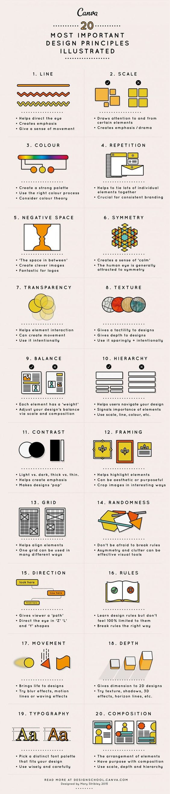

# 20个最重要的图示设计原则

### 线条

* 视觉辅助
* 施加强调
* 运动感

### 比例

* 使一些元素更加引人注目
* 施加强调／戏剧效果

### 色彩

* 创建一个丰富多彩的色板
* 正确的使用配色
* 了解色彩原理

### 重复

* 便于将许多单独元素绑定
* 对连续性的刻板至关重要

### 反相

* 介于两者之间的空间
* 制作灵动的图片
* 制作 logo 非常理想

### 对称

* 营造一种「冷静」感
* 人眼总会被对称吸引

### 透明

* 帮助元素交流
* 可以创造运动感
* 细加考量地使用

### 材质

* 让设计充满触感
* 让设计富有深度
* 细加考量地使用，俭省地使用

### 平衡

* 每个元素都有重量
* 借由尺寸和排版调整设计的平衡

### 等级

* 帮助用户在你的设计导航
* 传达元素的重要性
* 运用尺寸，线条，色彩

### 对比

* 光与暗，轻与重
* 有助于施加强调
* 使设计「新潮」

### 框架

* 有助于高亮元素
* 审美的或是有意义的
* 用有趣的方式修剪图片

### 网格

* 有助于对齐元素
* 一个网格可以有多种使用方式

### 随机

* 别怕打破规则
* 不对称和杂乱可以称为有效的视觉工具

### 方向

* 给予观看者视觉路径
* 以「Z型」，「L型」，「Y型」引导视线

### 规则

* 学习设计规则但是不要被完全限定
* 以合适的方式打破规则

### 运动

* 使设计变得鲜活
* 尝试模糊效果，运动路线或舞动效果

### 深度

* 使两维图形增加维度，更加立体
* 尝试材质，阴影，3D 效果，平行线

### 字体

* 挑选一个适合设计的独特字体组合
* 明智和谨慎地使用

### 排版

* 元素的布置
* 有意地排版
* 使用比例，深度和等级

