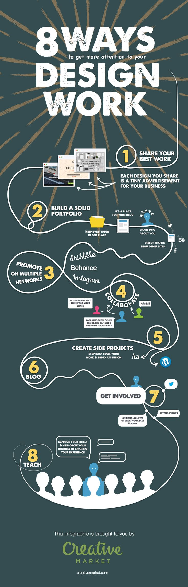

# 8种聚焦于设计的方法

1. 分享你的最佳设计作品

你所分享的每一个设计都是为你的工作所做的些许推广

2. 创建有效的工作包

- 将所有材料放在一起
- 存放你的文章
- 分享你的介绍
- 从其他网站直接获取流量

3. 利用多种渠道营销

- dribbble
- behance
- instagram

4. 协作

- 协作是一种展示作品的最佳方式
- 和其他设计师一起工作也会磨练你的技能

5. 创建小项目／副项目

- 停下手头的工作，注意

6. blog

7. 积极参与

- DesignerNews 论坛或 CreativeMarket Forums
- 参与事件

8. 写教程

- 提高你的技能 & 通过分享你的经验使你的生意获得增长