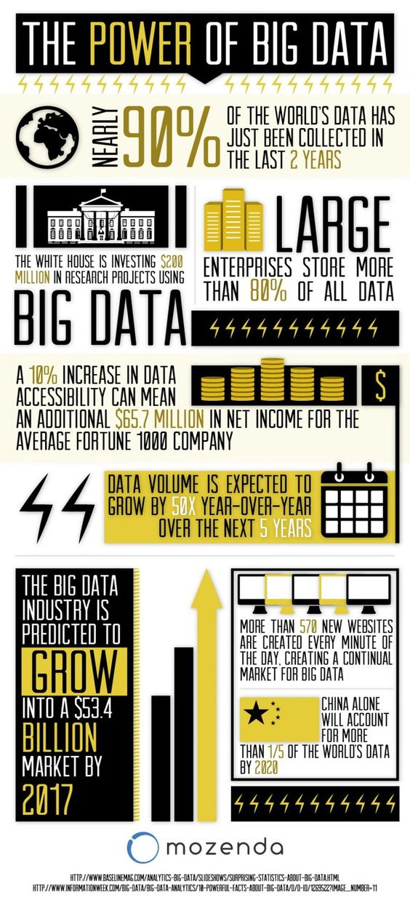

# 大数据的力量

##### 1.世界上接近90%的数据是在过去的两年内收集的

##### 2.白宫已经向各类研究大数据的项目，累计投资了两亿美元

##### 3.大公司储存了所有数据的80%以上

##### 4.对于一家名列**财富1000强**的公司来说，在数据可访问性(accessibility)上每提升10%，就意味着额外增加6570万美元净利润

##### 5.根据预测，数据容量(data volume)在接下来的五年内，每年将以50倍速增长

##### 6.大数据产业的市场规模预计会在2017年内增长到534亿美元

##### 7.每分钟会诞生570个新网站，这为大数据创造了一个可持续的市场环境

##### 8.到2020年，中国将占据全球数据总量的1/5以上