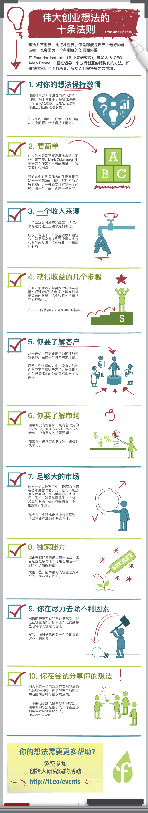

# 伟大创业想法的十条法则

## 原图

> 想法并不重要，执行才重要。但是即使是世界上最好的创业者，也会因为一个有瑕疵的创意而失败。

> 在 Founder Institute（创业者研究院)，创始人 & CEO Adeo Reseei 一直在倡导一个分析创意的结构化的方法。如果你检查核对下列条目，成功的机会将会大大增加。

## 1. 对你的想法保持激情

如果你只是为了赚钱而追求这个创意，马上停止吧。金钱或许是一个巨大的激励，但是它无法帮你渡过创业的漫漫长夜

在未来的10年中，你会一直努力解决这个问题并始终保持激情么？

## 2. 要简单

伟大的创意是不断发展出来的，而非生来完美。Mark Zukerberg 并不是突然在某天早晨醒来说：「我要做社交网络」

我们这个时代最伟大的生意都是开始于一些简单的创意，然后不断扩展而成的。一开始专注解决一个问题，用一个产品，面向一种客户。

## 3. 一个收入来源

一个创业公司最初只建立一种收入来源远比建立三四个更加幸运。

所以，专注于一个收益源以开始创业，如果你没有找到那个可以支持业务的收益源，这也许是一个糟糕的业务。

## 4. 获得收益的几个步骤

在你开始赚钱之前需要完成哪些事情？通过尝试这种练习以确知利益相关者的数量，这个过程包含着相当的复杂性。

在3步之内获得收益是最理想的情况。

## 5. 你要了解客户

从一开始，你需要密切地知道那些急需你产品的一个具体需求场景。

显然，你认识的人中，没有人能比你自己更了解这些需求。这就是为什么很多伟大的公司都成型于个人需求。

## 6. 你要了解市场

如果你没有对目标市场有着领先的专业知识，你怎么会对市场的未来会有一个有意义的远景预期？

如果你不是这方面的专家，那么赶快学习。

## 7. 足够大的市场

任何一个目标客户小于1000万人的或者年度营收低于几十亿的市场是难以发展的，也不值得你花费时间。例如，如果你赢得了一个5亿规模的市场，你也只会拥有一个500万的生意。

你会在一个狭小市场中销声匿迹，所以不要在墓地中开始创业。

## 8. 独家秘方

你正在做的事情是否独一无二，或者远超竞争对手？你是否知道一个别人不了解的秘密？

大胆一些，因为最好的创意是变革性的，而非修补性的。

## 9. 你在尽力去除不利因素

积极的解决方案非常容易找到，但是在创意阶段，你的工作是找到那些破坏你的创意的因素。

然后，通过迭代创意一个个地清除这些不利因素。

## 10. 你在尝试分享你的想法

别人抛弃一切而帮助你实现想法的机会微乎其微。你最好在力所能及的范围内获得尽量多的反馈。

「不要担心别人会窃取你的想法。如果你的想法是独创的，你甚至必须这些想法硬塞给别人」 - Howard Aiken

