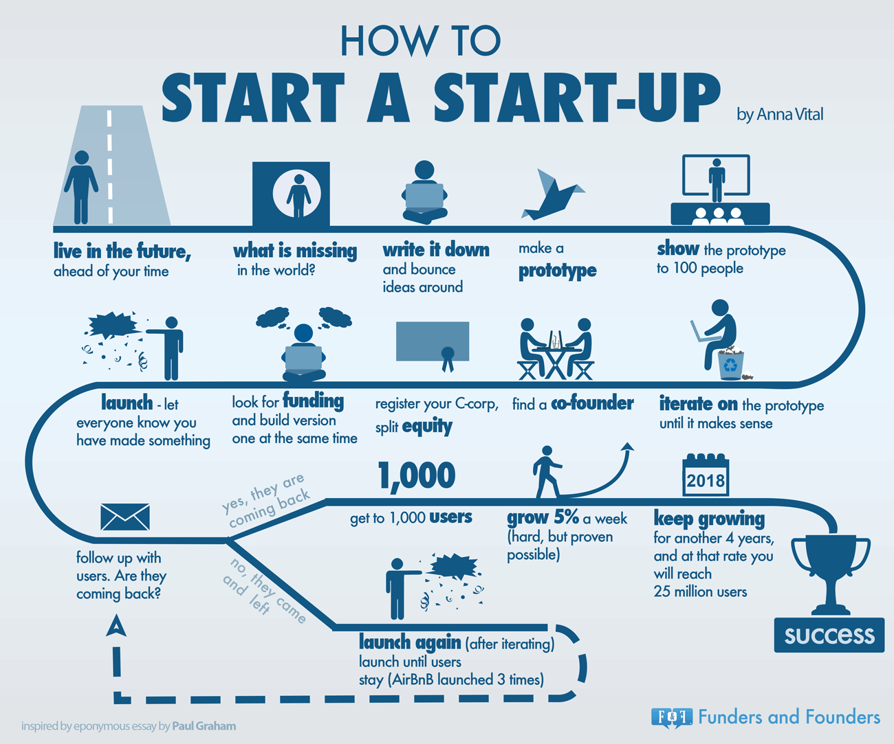

# 如何开始一家创业公司

- 1.**活在未来**，超越你的时间
- 2.这个世界，**缺少些什么**？
- 3.**写下想法**，不断完善你的创意
- 4.制作**原型**
- 5.给100个人**展示**你的原型
- 6.**迭代**原型直到获得认可
- 7.寻找**合伙人**
- 8.注册你的股份有限公司，分割**股本**
- 9.寻找**投资**同时制作版本1.0
- 10.**开始**-让所有人知道你已有所行动
- 11.跟进用户。他们会回来么？
- 12.A:是的，用户回来了
	- A1.获得1000个**用户**
	- A2.每周**增长5%**(很困难，但仍有可能)
	- A3.**保持增长**在接下来的4年中，你将获得2500万个用户
	- A4.迈向`成功`
- 12.B:不是，用户离开了 
	- B1.**重新开始**(不断迭代直到用户存留，AirBnB重启了3次)