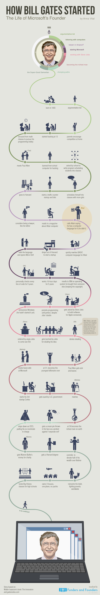

# 比尔·盖茨创业史

微软创始人的生涯

#### 1955年：出生

#### 好争论的小孩

#### 开始接触电脑

#### 成为律师还是辍学

#### 创立微软

#### 和乔布斯合作

#### 成为世界首富

#### 开始转型

#### 超级慈善家

## 内容

* 生于1955年
* 好争论的小孩
* 父母鼓励他竞争
* 在13岁开始编程
* 翘数学课去追求编程爱好
* 认识 Paul Allen
* 因为黑客行为被禁止使用学校电脑
* 应学校要求为学校编写安排课程的程序
* 将自己安排到女孩更多的课程
* 创业做交通流量计数器，然后失败
* 去上哈佛大学
* 考虑成为律师，就如他的父亲
* 在杂志中了解到" Altair Computer "
* 告诉 Altair 他为之开发了编程语言（尽管他没有）
* 迅速地为 Altair 重写了 Basic 编程语言
* 从哈佛辍学，开始创业
* 卖掉了这个语言，创立了 Micro-Soft
* 五年中，一直检查每行代码
* 五年中，每天工作16个小时
* 把买来的操作系统卖给了IBM \(而且保留版权\)
* 被 Steve Jobs 要求为 Apple 创建独占软件
* 坚持编程，直到完美而不在乎 Jobs 的质疑
* 宣布 Windows 到来 \(尽管还没开始\)
* 被 Jobs 发现抄袭他的创意
* 否认抄袭

> 好吧...我们有一个富有的邻居，施乐，我破窗而入，想要偷走电视，却发现你捷足先登

* 与 Paul Allen 交恶，Paul 离开了公司
* 31岁时，成为了有史以来最年轻的十亿富翁
* 在微软遇到了未来的妻子
* 创立了他的第三家创业公司 Corbis
* 被美国政府起诉
* 结婚
* 39岁时，成为世界首富
* 在抗议「邪恶大亨」中被奶油蛋糕砸到脸
* 让出CEO职位，让前室友上台
* 和 Warren Buffet 一起做慈善
* 得到哈佛学位
* 确认捐出终身财富的一半
* 重新发明厕所，在全球范围内对抗贫穷
* 拥有三个房子，一架飞机，没有游艇
* 资助高中生参与「大历史」课程
* 未完待续

