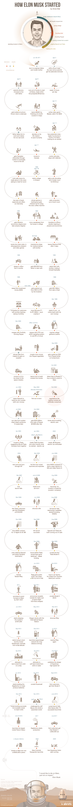

# 埃隆·马斯克的创业史

#### 1971年：出生

#### 在南非度过艰难的童年

#### 自学成才的程序员

#### 在大学名列前茅

#### 创立 Zip2

#### 创立 Paypal

#### 从零开始制造火箭

#### 开始 SpaceX 项目 和 Tesla

#### 异军突起

#### 把人类送上月球

- 他的工程师父亲和模特母亲生下了他
- 沉默寡言，让父母误以为耳聋而摘除了他的腺样体
- 每天阅读10个小时
- 读完家中的书，去图书馆阅读，阅读整本《大英百科全书》
- 父母离婚，选择和父亲生活
- 在学校受到欺凌，被扔下楼梯
- 在3天内学完了六个月的 BASIC 课程
- 12岁：编写视频游戏 Blastar ，以500美元的价格售出
- 14岁：遇到「存在危机」-阅读银河系漫游指南寻找答案
- 决定人生目标：拯救人类
- 父亲带他去上班，让他做真正的工作
- 通过母亲(加拿大人)成为加拿大公民，最终目的地是美国
- 来到加拿大
- 做稀奇古怪的工作，和亲戚朋友待在一起
- 得到一份在锅炉房打扫卫生的工作，时薪18美元
- 18岁：在渥太华上大学
- 向他在报纸上看到的老板们自我推销，邀请他们一起吃午餐
- 一家银行的高管回复了他，并给他提供实习机会
- 在银行业务上面展现天赋，但是因为使用高管的咖啡机而遭到训斥
- 在宿舍出售电脑
- 转到宾夕法尼亚大学主修物理学和经济学
- 在大学的房间开一个黑酒店
- 获得沃顿学院的经济学学位（随后获得物理学学位）
- 同时做两份实习：超级电容器研究和视频游戏开发
- 和弟弟一起头脑风暴医学创业计划
- 去斯坦福大学读哲学博士，两天之后离开
- 和弟弟创立Zip2，完全由自己编程
- 得到父亲的28,000美元作为创业资金
- 前三个月，在办公室过夜
- 获得了第一笔300万美元投资
- 被投资人从 CEO 推到了 CTO
- 出售 Zip2，获得2200万美元
- 创立 X.com - 一家在线银行（自己掏钱）
- 花100万美元买一辆 McLaren F1，不久之后撞车
- 和另一家在线银行创业公司 Confinity 竞争顾客
- 和 Confinity 合并，新公司叫做Paypal
- 和CTO争论选择哪个操作系统（PC或Linux）
- 和大学女友 Justine 结婚
- 作为 Paypal 的 CEO，被赶下台（在蜜月期间）
- 尽管如此，还是向 Paypal 追加投资
- 几乎因为在假期感染的疟疾死去
- 搬到洛杉矶便于靠近航天业
- 从书中学习如何制造火箭
- 去俄国购买可以发射到火星的火箭
- 谈判失败，意识到火箭被人为定价过高
- 首个孩子出生
- 开始 SpaceX 来制造自己的火箭（自己掏钱）
- 刚出生十周的儿子死于突发的新生儿死亡综合征
- 从 Paypal 出售获得 2500万美元（税后1800万）
- 开始思考制造电动汽车
- 与电动汽车拥趸 JB Straubel 见面
- 和 Tesla 创始人见面，他提出了 Mask 想要的电动车
- 投资 Tesla，建议JB 和 Tesla 创始人一起工作
- 通过体外人工授精生下一对双胞胎儿子
- 第一次发射火箭，火箭爆炸
- 赢得为 NASA 运送物资到国际空间站的合同，开始制造 Falcon-9
- 成为 SolarCity 的第一个投资人（表亲的公司）
- 三胞胎儿子出生
- 火箭第二次发射失败
- 第一批 Tesla 顾客以 109,000 美元的价格得到他们的 Tesla Roadster
- 和妻子离婚
- 第三次发射失败，四颗卫星毁坏，包括 NASA 的卫星在内
- SpaceX 和 Tesla 都用完了资金
- 第四次发射成功
- 赢得了 NASA 的16亿美元的合同啊，共12次飞行
- 意识到 SpaceX 幸免于破产，喜极而泣
- 在 Tesla 即将破产的几小时前，获得投资
- 发布第一辆 Tesla Model S
- 低价从丰田破产的合资公司买下汽车制造厂
- Tesla 以每股 17美元的价格公开上市，收于24美元
- 和 Talulah Riley 结婚
- 承诺在在2021年到2031年将人类送上火星
- 发布可回收火箭（使太空飞行的成本降低了100倍）
- 发布 Model X（SUV）
- 和 Riley 离婚
- Dragon 号和国际空间站对接
- 以75,000美元的价格销售 model S
- 开始尝试在低纬度垂使模型火箭 Grasshoper（草蜢号）垂直着陆
- 开始组建超级充电网络（为远距离驾驶）
- 和 Riley 复婚
- 发布了 Hyperloop（超回路列车）轨道的设计
- 尝试使火箭从轨道软着陆到水面上
- 尝试使火箭从轨道着陆到舰船上
- 开始修建 Gigafactory（千兆工厂）以大规模生产锂电池
- 发布 Powerwall （锂电池充电站）
- 火箭发射失败（19次成功发射后的第一次失败）
- 受到 Jeff Bezos 的亚轨道火箭挑战
- 火箭着陆成功（第一个进入轨道的可回收火箭）
- 发射他的最大火箭 Falcon Heavy
- Gigafactory 投入生产
- 第一批客户得到了他们的 Model 3 - 售价 35,000美元
- 第一列 Hyperloop 列车开始运行
- 火星殖民运输飞船发射
- 飞往火星的机票一张 500,000美元