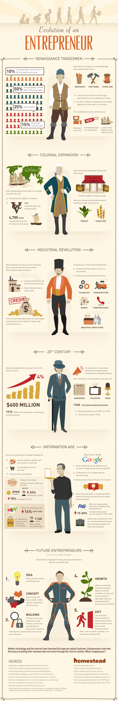

# 企业家的进化史

### 文艺复兴商人

**10%**的人口控制了50%的财富和收入

**50%**的人口分享了15%的财富

**25%**的人分无分文

**15%**的逐渐壮大的商人阶级

---

中世纪大约25%的职位是和农业无关的

- 商人
- 工匠
- 其他职业

> 工匠通过学徒制学习专业知识，学徒制最多长达七年

> 工匠行会被设立以期获得更多的收入和在市民生活中增加影响力

市场成为了中心点

- 不断发展商业
- 对新产品日渐增长的需求
- 引领着驶向外国的贸易扩张

### 殖民扩张时代

造船技术的进步推动着国际商贸往来的增加

> 出现了第一家「跨国」公司

> 1637年荷兰东印度公司(VOC)成立

4785条商船运输着2500万吨商品

商人沿着主要的商路建立商贸点，为过往商旅提供补给

美洲农民和种植园主种植例如烟草和甘蔗等经济作物以获取资本

### 工业革命时代

大多数企业家都会发明一些东西并出售，然后开始下一项发明。这些发明大多致力于：

> 提高生产力和自动化制造

> 利用规模化制造降低成本

第一个信用扩展系统的使用，帮助企业家确保用于大规模，高风险的商业投资的资本的安全性。

工业革命时代的企业家：

> 改变了19世纪的商业和工业

> 创造了伟大的科技进步：

- 技术领域
- 交通领域
- 能源领域
- 通信领域
- 工业生产领域

### 20世纪

广告花费增长到国家收入的4%

1910年-大型企业已经在广告营销上花费了6亿美刀

大众媒体营销的大量使用改变了企业家销售产品的方式

现在商人们可以向全国销售产品，通过：

- 报纸
- 电视
- 广播

1948年-电视营销萌蘖

> 从 1947 年开始，广告收入提升了515%

> 933 个赞助商购买电视广告

### 信息时代

个人电脑已经改变了日常生活：

> 互联网允许全球访问和及时互联

> 能够以更低的成本在网上销售商品

> 小生意市场：

Etsy - 受欢迎的在线零售平台：家庭装饰品，珠宝，服装，艺术品和工艺品

在2012年：销售额达到8.95亿美刀，相比2011年增长了70%，新买家增加了83%

ebay - 商品销售额每年增加14%

57% 的市场收益来自美国以外

1.13亿 用户，相比一年前增加了13%

Google 的在线广告

> 精明的销售会利用 Adwords 以较低成本获得更多关注和高投资回报率(ROI)

> 创业者可以轻松地和大公司竞争

众包增加了创新的步幅

> 通过请求一大群人的帮助来提出新创意或完成乏味的工作

> 在 P&G，25%的新产品产生于众包创意，同时将新产品成功率由15%提高到50%

现代的企业家不仅仅创造产品/服务，他们还得管理员工，领导新公司

### 未来的企业家 - 你拥有这些潜质么？

尽管技术不断发展进步，胸怀壮志的企业家们始终使用着相似的方法：

- 1.想法：有一个产品，一项服务或者其他可以出售的东西
- 2.概念：判断这个想法是否可行，做市场调查，完成商业计划
- 3.开发：寻找和获得资源(一般是金融资源，也可以是其他资源)，营销，投资时间，利用资源，运营项目
- 4.成长：理想条件下，发展良好的项目会需要持续的培育，关注，如果可能的话，获得投资者，茁壮成长，只要盈利就继续扩张
- 5.退出：这取决于商业计划，所有投资都需要退出机制，变成一个世代传承的家族企业，卖给其他公司，或者开始首次公开募股(IPO)

现代科技和互联网改进了我们做生意的方式。企业家如今享受着无比的便利：仅仅通过点击按钮就能将商业想法付诸实现。那么，是什么让你止步？