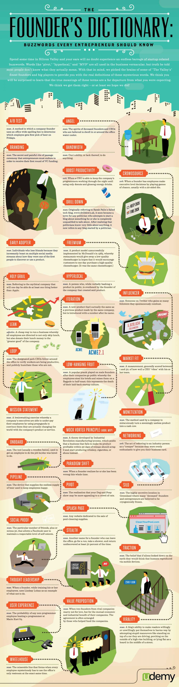

# 创始人词典

每个企业家都应当知道的时髦词汇

> 在硅谷待一段时间后，你的耳鼓
会毫无疑问地经历着创业热词的轰炸。诸如「转型」，「超本地化」，「模拟漩涡理论」之类的词汇在商业术语中广泛使用，但事实上，大多数人并不知道他们所用词汇的真实含义。意识到这点之后，我们挑选了硅谷中最好的创业者和企业家为我们解释神秘词语的含义。相信你一定会惊讶地发现这些术语的的真实含义和你所期望的答案相差甚远。

> 我们认为我们的解释是对的，至少我们希望这样。

### A/B TEST 

A/B 测试

名词，一种公司创始人用来决定哪个雇员获得周五啤酒的优先选择权的方法：开展一场全公司参与的拼词比赛

### Angel

天使

名词，已故的创始人和CEO的魂灵，被认为在办公室的饮水机里面或附近定居

### Branding

品牌化

名词，一种创始人为了获得第一轮的风险投资基金，必须经历的神秘而痛苦的通过礼仪(一个社会学术语，例如生日，成年礼和朝圣)

### Bandwidth

带宽（或瓶颈）

名词，一个人做任何事的能力，或其不足

### Boost Productivity

提高工作效率

动词，此时 CEO 让程序员们整夜工作，直到除了甜甜圈和人参能量饮料之外无计可施

### Crowdsource

众包

动词，此时公司创始人让员工通过玩概率游戏，通常是 "20-sided die"，来做管理级别的决策

### Drill Downn

名词，最初指 Sarah Palin 失败的技术博客 "www.drilldown.ak"，后来成为了一个术语，描述那些建立博客谈论一些自己无法胜任话题的政客。意识到政客们大多一无所知之后，" Drill Down " 开始指代任何政客建立的博客

### Early Adopter

最初使用者

名词，指一群没朋友的家伙，因为他们不断在各种社交平台上吹嘘他们最先探索和使用某个产品

### Freemium

免费模式

名词，麦当劳在1983年尝试失败的产品模式：餐厅免费赠送劣质的奶酪汉堡期望能够激励顾客某天购买优质的奶酪汉堡（其实是一样的汉堡）

### Holy Grail

圣杯（努力追求之物）

名词，指那些未来某天可能会在不止一个方面击败苹果的神秘公司

### Hyperlocal

超本地化

名词，一个人公开口头抨击某个产品，被该公司的创始人无意听到

### Iteration

迭代

名词，一个实际上和这家公司之前产品相同的新产品，但是发布时名词后面加上了一堆奇怪数字

### Influencer

影响者

名词，一些在 Twitter 上获得了大量可能会自发消失的粉丝

### Lean

瘦的（又译为精益的）

形容词，一种低成本经营公司的方法：员工们不但被要求不吃午餐，而且要为「公司更好的食物」而捐出午餐钱

### Loop

环路

名词，CEO们所巡逻的指定路线，确保员工处于工作状态，并且公开谴责那些没在工作的员工

### Low-Hanging Fruit

低挂果实（指容易实现的目标）

名词，一个流行的关于男性创始人公司上市的恶作剧，员工窃取了他的信念，将他们当作旗杆以便降半旗（致敬），这代表着创始人的闲适的创业文化的死亡

### Market Fit

适应市场

名词，一种度量标准，通常得分介于1和50，描述 CEO 对他／她的团队感觉有多好

### Mission Statement

使命宣言／陈述

名词，一种洗脑方式：公司管理者通过大肆宣传使员工确信能够用公司的产品或服务改变世界，从而付给员工较低的工资

### Mock Vortex Princople （MVP）

模拟漩涡理论

名词，一个由工业革命时代制造业巨头提出的理论：它假设那些无法在发布90天内让产品有盈利的生意应该付诸一炬，然后开始生产威士忌，香烟和鞋子

### Monetization

变现

名词，一种公司用来将看起来毫无用处的产品变为现金牛的神奇方法

### Networking

笼络

动词，指称呼某个行业人士为 “Creeper” 的行为，因为他们在递给你商业名片这件事上表现出了过高的热情。

### Onboard

入职

名词，一种工具（通常是木质的指挥棒）：用来督促员工去做那些他被雇来做的事情

### Paradigm Shift

范式转移

名词，当创始人意识到他／她自己这次错得一塌糊涂的时候

### Pipeline

管道

名词，一种设备，不限量地供应啤酒使员工一直快乐

### Pivot

转向

名词，认识到你的"Dog and Pony show"可能要比一大群猫更有吸引力

### Silo

仓筒

名词，在格陵兰某个高度机密的地方，很多「死去的」创始人和企业家被认为低温冷冻

### Splash Page

引导页

名词，任何用于销售泳池清洁用品的网页

### Social Proof

社会认同

名词，特定数量的朋友，一般50个左右，这帮助一个Facebook用户维持着感觉良好的自尊心

### Stealth

潜入

名词，用于描述在一半的时间里创始人离开公司，跑步，淋浴然后悄悄地回到公司的另一个名字

### Traction

摩擦

名词，一种信念：如果外星人俯视地球，他们也许会认为人类通过移动设备繁殖

### Value Proposition

价值主张

名词，当两个敌对公司的创始人不是因为爱情而结婚，而是为了共同的经济和企业利益。这种协议一般由帮助投资公司的人安排

### Virality

病毒式

名词，博客的能力使读者情愿或不情愿地将他们自己置于危险的境地，例如站到正在驾驶汽车的顶上，或住在高楼大厦外面，又或者在像木板一样平躺在马路中间

### User Experience

用户体验

名词，任何非程序员在 "Mario Cart 64"（一个赛车游戏）中击败一个程序员的可能性

### Wheelhouse

掌舵室

名词，一个悲惨的队列，在公司的所有员工不得不在同一时间使用同一个洗手间时形成

