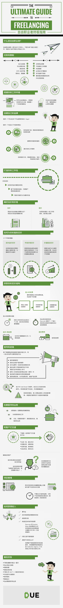
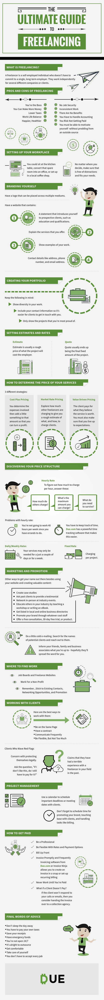

# 自由职业者终极指南

---

# 原图

## 什么是自由职业者？

自由职业者是一群为自己工作的人，不是为单个雇主长期工作，而是为几家不同的公司独立工作。

## 优势和限制

优势|限制
---|---
自己当老板|没有职业保障
可以挣更多钱|不规律的工作周期
更低的税|利润微薄
工作-生活平衡|必须自己打理账务
更快乐，更健康|有可能拿不到钱
|要依靠自我激励而没有外在资源的奖励

## 搭建你的工作环境

你可以坐在餐桌上，把厨房空间变为办公室，或者建一个本地的咖啡台

无论你决定在哪里工作，确保避免分心和符合需要

## 创建自己的品牌

制作一个可以在多个平台使用的标志

制作一个包含以下内容的网站：

- 你的自我介绍；例如你的教育经历和资质证明
- 解释你所提供的服务
- 展示你的工作案例
- 你的联系方式，例如联系地址，电话号码和电子邮件

## 打造你的工作包

记住这些：

- 在你的作品中展现多样性
- 包含你的联系信息，方便客户更容易地联系你
- 只展示你最引以为豪的作品

## 确定估价和价格

### 估价

预估价往往是雇主需要为这个项目支付资金的粗略价格

### 报价

当项目的最后一些工作完成时，报价随之结束

## 如何为你的服务定价

三个不同的策略：

### 成本溢价定价

在项目的相关花费的基础上提高价格，以确保你可以盈利

### 市场价格定价

探索其他自由职业者的服务价格将给你一个关于收费项目和收费方式的粗略估算标准

### 价值驱动定价

顾客为他们认为值得的服务付费。你必须保证你的服务满足用户的预期

## 探索你的定价结构

### 按小时收费

要弄清楚每小时的收费标准，先回答下列问题：

- 其他人收取的费用？
- 你收取的最高费用？
- 你需要的最低费用？

按小时收费的问题：

- 你的工作时间无法达到40个小时，因为你还有其他事情要做
- 你必须记录好时间，Due.com 提供了一个强大的时间记录软件来使时间记录变得简单

### 按天/周收费

也许你只需要提供几天／几周的服务

### 固定费用

按项目收费

## 宣传和促销

除了搭建网站和创造高价值的内容之外，有一些让你名声大振的其他方法：

- 制作案例研究
- 请求过往客户提供推荐
- 在行业事件／活动时亲自联络关系
- 通过运营工作室或者写电子书来帮助行业中的其他人学习
- 被列入本地和在线的商业目录（黄页）中
- 通过制作任酷炫的东西来推销品牌
- 提供免费咨询，30天免费试用，或者产品试用

发少许 Cold Email(冷邮件，给泛泛之交发的求助邮件)。寻找潜在客户的名录，并试着接触他们

告知你的朋友，家人和商业联系人你在做的事情 - 希望他们能帮你扩大信息的传播范围

## 在哪里寻找业务

- 求职板块／招聘网站和兼职网站
- 为非营利机构工作
- 记住，挖掘现有客户，联络潜在机会，推销你的业务

## 和客户打交道

下面是一些和客户打交道的方法：

- 达成一致，建立共识
- 签署合同，排除风险
- 经常沟通，保持联系
- 适当灵活，保持主见

难相处的客户

他们很注意合法地保护自己的利益

会问这样的问题「如果我不喜欢这些，我还需要付钱么？ 」

总会提起他们过去和本行业的自由职业者打交道时的糟糕经历

## 项目管理

用日历安排和记录重要的截止日期或与客户约定的会议日期

不要忘记为宣传品牌，与用户初步联络和处理任务（例如账单）的安排时间

## 如何获得收入

- 要专业
- 定价和收费选项要保持灵活
- 收取预付款
- 快速且及时地开具发票

> Due.com 和 Invoice Ninja 的发票软件允许你快速生成发票或建立重复计价订单（订阅类服务）

- 付款之前不提供服务
- 顾客不付款怎么办？

> 如果客户拒绝接受你的电话或邮件，你就需要考虑将账单交给 Collection Agency 了(为其他公司代收欠款的公司)

## 最后忠告

- 不要在睡眠中度过一整天
- 你必须自己纳税
- 保留收据
- 准备应急资金
- 不要工作 24/7（一周的所有时间）
- 外包是可以接受的
- 保持愉悦
- 照顾自己
- 没必要接受所有业务

