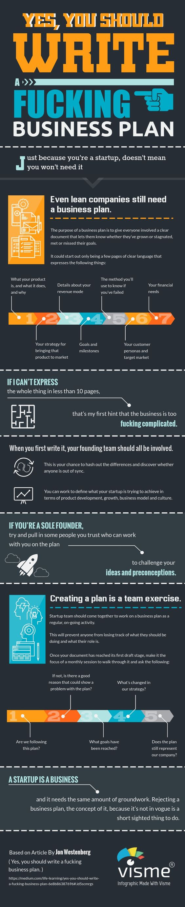

# 是的，你必须写一份该死的商业计划

只因为你是一个创业者，这不意味着你不需要它

## 小公司仍然需要一份商业计划

商业计划的目的是为了给每个相关者一份清楚明确的文档，以便他们知道公司是茁壮成长还是陷入停滞，是正在不断接近目标还是渐行渐远。

只有商业计划清楚地解释了以下概念时，生意才算真正起步：

- 1.你的产品是什么，它有什么用处，为什么
- 2.你将产品投放到市场的策略
- 3.盈利模式的详解
- 4.目标和里程碑
- 5.确定是否失败的方法
- 6.你的客户肖像和目标市场
- 7.你的金融需求

## 如果你讲不清楚

在少于10页的篇幅内

- 这是说明你的生意太过复杂的第一个提示
- 第一次写的时候，你的投资人团队都应该被涉及
- 这是一个求同存异的好机会，并且发现是谁不在一个步调
- 就产品开发，发展，商业模式和文化而言，你可以找到你的创业公司想要达到的目标

## 如果你是一个独立创业者

- 尽量拉一些你相信可以和你共创大业的人
- 挑战你的先入之见

## 创建一个商业计划是一个团队活动

- 创业团队应该坐下来一起将商业计划当作一个例常的，不断发展的活动
- 这将阻止一些人对自己该干的事情和该扮演的角色失去了解
- 一旦你的文档到了初次草拟阶段，让它成为每月例会的焦点，大家一起走查，问这些问题
- 1.我们在按照计划行动么
- 2.如果没有，有没有好的理由来说明计划中存在问题
- 3.哪些目标达到了
- 4.我们的战略有哪些变化
- 5.计划仍然能代表我们的公司么

## 一次创业就是一个生意

- 这需要同样大量的基础工作。拒绝商业计划，这样的想法，不是潮流而是近视。