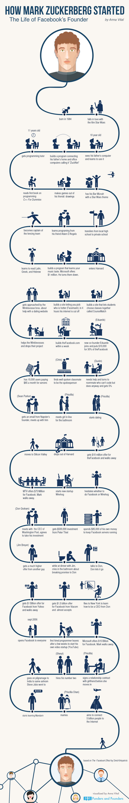

# 扎克伯格创业史

Facebook创始人的生涯

- 出生于1984年
- 爱上《星球大战》电影
- 10岁：看到了爸爸的电脑并开始学习
- 搭建了连接他爸爸电脑和办公室电脑的网络
- 11岁：学习编程教程
- 阅读他的第一本编程书籍 《C++ 新手指南》
- 把朋友的手绘图画做成游戏
- 拥有了他的星战主题的"Bar Mizvah"
- 从本地的公立高中转学到私人学校
- 向他的朋友 Adam D'Angelo 学习编程
- 成为学校击剑队的队长
- 学习拉丁语，希腊语和希伯来语
- 开发学习用户音乐品味的程序。微软报价100万美刀，他一口回绝
- 进入哈佛大学
- 建立了让学生们一起在线选课的网站，CourseMatch（我们可以称之为匹课网）
- 建立了让你选择「谁更辣」的网站，Facemas，不到四小时，他的网络就被切断
- Winklevosse 兄弟接触到了 Zuck，让他帮忙做一个约会网站	
- 帮助 Winklevosse 兄弟做网站，然后抛弃他们的项目
- 用不到一周的时间，创建了 theFacebook.com
- 新联合创始人 Eduardo 加入，而且投入10,000美刀获得 theFacebook 30%的股份
- 需要帮助，找到了室友，虽然不会编程，却可以做很多事情，Dustin 获得了5%的股份
- 找到善于演讲的同学，邀请他成为发言人
- 获得了10,000个用户，每月在服务器上花掉85美刀
- 收到 Naspter 创始人的邮件，并和他见面
- 排队去洗手间时遇到一个姑娘
- 开始和她约会
- 得到一千万美刀的收购邀约，但是不欢而散
- 从哈佛辍学
- 搬到硅谷
- MTV给出7500万美刀的收购价，但是 Mark 还是拒绝
- 创立新公司 Wirehog
- 在 Facebook 和 Wirehog间犹豫
- 自己拿出 85,000 美刀让 Facebook的服务器维持运行
- 得到 Peter Thiel 的50万刀的投资
- 和华盛顿邮报的 CEO会面，同意接受投资
- 收到另一个人(Jim Breyer)更高的报价
- 在和 Jim 共进晚餐的时候，在卫生间因而打破了和 Don的协议
- 打电话告诉 Don，Don 告诉他不要介怀
- 飞到纽约向 Don学习怎么做一名 CEO
- 得到 Viacom对 Facebook15亿刀的报价，他几乎接受了
- 得到 Yahoo对 Faceboook10亿刀的报价，仍然拒绝
- Facebook 开放注册，任何人都可以使用
- 招聘的第一个员工在离开一段时间后，开始做视频创业创业公司（YouTube）
- 微软给出了 150亿的报价，Mark 拒绝了
- 在女友搬进来之前，和她签署了关系合约
- 雇用第二个员工
- 去印度朝圣，去了 Steve Jobs去过的那家静修寺
- 开始学习普通话
- 和 Priscilla 结婚
- 设定目标：帮助50亿连接到互联网
