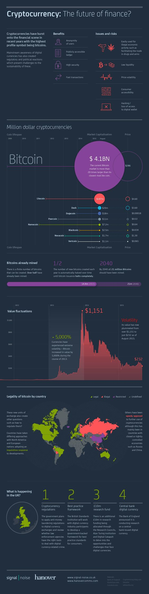

# 加密货币：金融的未来？

近年来，加密货币在金融界声名鹊起，其中声名最为显赫者当属比特币(bitcoin)

对数字货币的主流认知也造成了相应的监管和政治举措：现在成为电子货币存续所遇到的最大挑战。

### 优点

+ 用户匿名使用
+ 公开，可访问的分账账簿
+ 高度的安全性
+ 快速的交易处理

### 问题 & 风险

+ 易被用于非法经济活动，例如武器或毒品交易
+ 低流动性
+ 价格不稳定
+ 消费者不易理解
+ 电子钱包被破解或丢失

## 加密货币： 百万美元

比特币：比特币的市场比最接近的竞争者莱特币要大20倍

### 已经挖掘的比特币

比特币的可生产数量是有限的。超过半数的比特币已被挖掘。

### 1/2

每年产生的比特币数量将会自动减半，直到比特币完全停止发行。

### 2040

截至 2040年，全部的2100 万枚比特币将被挖掘殆尽。

## 比特币在各国的合法性

这种全新的交易方式同时引发了新的问题：如何监管比特币

各国对比特币采取着不同的监管方式：北美和欧洲国家对比特币发展持探索态度

另一些国家则公开禁止加密货币的进一步使用。尽管这些国家大多是经济更加集中化的国家，例如俄罗斯和中国。

## 将在英国发生什么？

### 1. 加密货币监管

英国政府计划施行针对电子货币交易的反洗钱措施，并且考量执法部门是否有合适的工具来以处理数字货币相关的犯罪行为。

### 2. 最好的实践框架

英国标准化组织将和数字货币行业的从业者一起制定一个政府支持的框架，以期为消费者提供最好的实践标准

### 3. 1000 万英镑的研究基金

此外，将会有额外的 1000万研究基金划拨给研究委员会，阿兰·图灵研究院和数字弹射器 (Digital Catapult) 等机构，用于探索数字货币的挑战和机遇。

### 4. 中央银行电子货币

英格兰银行早先宣布了一项正在进行的央行发行的电子货币研究。