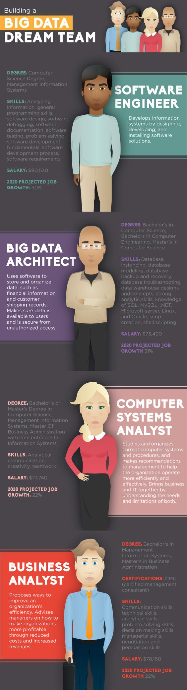

# 搭建一个大数据梦之队

## 软件工程师

通过设计，开发和安装软件解决方案

### 学位

计算机科学学位，信息管理系统

### 技能

- 分析信息
- 通用编程技能
- 软件设计
- 软件调试
- 软件文档撰写
- 软件测试
- 问题解决
- 软件开发基础知识
- 软件开发流程
- 软件需求

### 薪水

90,530 美刀 

### 2020年的预期职位增长： 30%

## 大数据架构师

使用软件存储和组织例如金融数据和客户物流记录等数据。确保数据对使用者的可用，且对未授权的访问保持安全

### 学位

计算机科学学士学位，计算机工程学士学位，计算机科学硕士学位

### 技能

- 数据库实例化，
- 数据库建模，
- 数据库备份和恢复，
- 数据库问题解决，
- 数据仓库设计和概念
- 强大的分析技能
- SQL，MySQL,.NET 知识
- 微软服务器
- Linux 知识
- Oracle，
- 脚本编写
- shell 脚本

### 薪水

73,490 美元

### 2020年的预期职位增长： 31%

## 计算机系统分析师

学习和组织当前的计算机系统和流程，并且为提高公司效率的管理操作提供建议。深入了解商业和信息科技和需求和限制帮助两者更好地协作。

### 学位

计算机科学和信息管理系统学士或硕士，信息系统方向的工商管理学硕士

### 技能

- 分析的
- 通信
- 创意
- 团队协作

### 薪水

77,740 美元

### 2020年的预期职位增长： 22%

## 商业分析师

提出提高公司效率的方法。为公司经理人提供通过降低成本和增加收入创造更多盈利的建议

### 学位

信息管理系统学士，工商管理学硕士

### 证明

CMC（认证管理顾问）

### 技能

- 沟通能力
- 技术能力
- 分析能力
- 问题解决能力
- 制定决策能力
- 管理技能
- 谈判和协商技巧

### 薪水

78,160 美元

### 2020年的预期职位增长： 22%