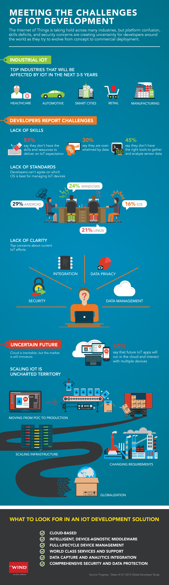

# 发现物联网发展的挑战

物联网正在很多行业开始产生影响，但是平台的混乱，技术的缺乏，和对安全的担忧等诸多问题给尝试将物联网从概念转变为商业部署的全世界开发者的带来了很大不确定性。

## 工业物联网

### 未来3-5年内首先会受到物联网影响的行业

+ 医疗行业
+ 自动驾驶
+ 智慧城市
+ 零售业
+ 制造业

## 开发者认为的挑战

### 缺乏相应技能

+ 51% 的人认为他们缺乏足够的技能和资源来实现他们的大数据期望
+ 30% 的人声称他们被数据支配
+ 45% 的人认为他们没有使用正确的收集和分析传感器数据的工具

### 缺乏一致标准

开发者们无法对选择管理物联网设备的操作系统达成一致

+ 29% android
+ 24% windows
+ 16% iOS
+ 21% Linux

### 缺乏明确描述

对当前的物联网工作的最大担忧

+ 数据整合
+ 数据隐私
+ 安全性
+ 数据管理

### 未来的不确定性

云服务无法阻挡，但是市场尚不成熟

+ 60% 的人认为未来的物联网应用将在云上运行，可以和多个其他设备交互
+ 规模化的物联网仍然是无人涉足的领域
+ 从概念证明（POC,Proof of Concepts)到可用产品
+ 规模化的基础设施
+ 不断变化的需求
+ 全球化

在大数据开发解决方案中要寻找哪些要素：

+ 基于云
+ 智能化，设备无关的中间件
+ 全生命周期设备管理
+ 全世界级别的服务和支持
+ 数据获取和分析的整合
+ 综合的安全的数据保护机制

