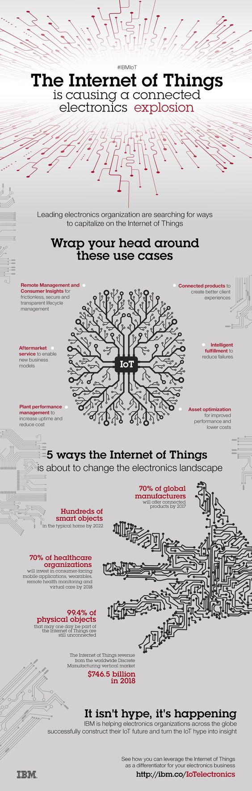

# 物联网正在推动一场连通联网电子设备的爆发

领先的电子行业组织正在寻找物联网资本化的方式

## 深入理解这些用例

+ 远程管理和对顺畅的，安全的，透明的生命周期管理的消费者洞见
+ 物联网产品可以创建更好的客户体验
+ 售后服务/衍生市场服务推动着新的商业模式产生
+ 智能实现减少失败发生
+ 工厂性能管理，提升运行时间，降低成本
+ 资产优化，提升性能，降低成本

## 物联网即将改变电子行业全貌的五种方式

+ 截至 2017年，全球 70% 的制造业公司将提供物联网产品
+ 截至 2022年，每个普通家庭都会有数以百计的智能产品
+ 截至 2018年，70% 的医护组织将会投资面向消费者移动应用，可穿戴设备远，程健康监测设备和虚拟护理设备
+ 99.4% 物体将在未来接入至今仍未出现的物联网
+ 截至2018年， 全球的来自离散制造垂直市场的物联网收入将达到 7465亿

## 这并非虚假宣传夸大其词，而是事实

IBM 帮助全球各地的电子组织成功地构建了他们的物联网未来，将宣传变为现实。