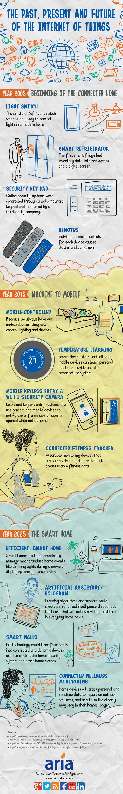

# 物联网：过去，现在和未来

## 2005 年，联网家居的开端

### 灯光控制

简单的开关装置曾经是一个现代家居唯一的灯光控制方式。

### 智能冰箱

第一个智能冰箱存储菜品数据，可以接入互联网以及一个数字屏幕。

### 安全密码面板

一个通过一个壁挂式的安全密码面板控制的在线安全系统，由第三方公司监控。

### 遥控器

每个设备都拥有遥控器造成了不便和混乱

## 2015 年，移动控制设备

### 移动控制

因为我们总会随身携带移动设备，所以现在我们用它们控制灯光和其他设备。

### 温度学习

由移动设备控制的智能温控设备可以学习个人习惯，提供个性化的温度系统。

### 移动免钥门禁 & WI-FI 安保摄像头

当用户不在家时，门锁和免钥门禁系统利用传感器和移动设备提醒用户门窗未关。

### 联网健康记录

可穿戴健康监测设备可以监测用户的实时生理活动，并记录为可用的健康数据。

## 2025 年，智能家居

### 高效，智能的家居

智能家居能够自动地管理常见的事件，例如看电影时调暗灯光或展示能耗

### 人工智能助手/ 全息

学习算法和传感器可以创造一个人格化的智能助手，充当日常家庭任务的帮手。

### 智能墙壁

物联网技术能够将墙壁变成可联网和动态化的设备，用于控制家居安保系统和其他事件。

### 联网健康监控

家居设备将监测个人的实时数据，给出关于营养，保健和健康情况的报告。老人们可以更多地待在家里而无须去医院。
