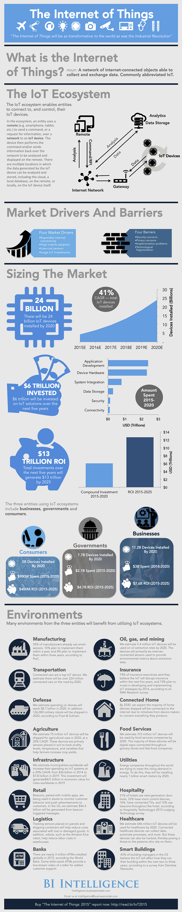

# 物联网简介

> 「物联网将带给世界的巨大变革可以和工业革命相媲美」

## 何为物联网

名词：一个由联网物体组成的互联网络，可以彼此收集和交换数据。通常缩写为 IoT

## 物联网生态系统

物联网生态系统帮助实体连接，控制他们的物联网设备

在其生态系统中，每个实体使用一个远程设备（例如手机和平板电脑）通过互联网向某个物联网设备发送指令或获取信息请求。该设备随后执行命令或者通过互联网将信息返回到远程设备，以便于分析和展示。许多不同位置的物联网设备所生成的数据都可以被分析和存储，这些位置包括是云服务器或者本地服务器，远程的或者是本地的物联网设备本身。

远程设备 -> 指令／信息请求 -> 互联网 -> 数据 ->  分析数据存储 -> 分析结果

## 市场驱动力和阻碍

### 四大市场驱动力

+ 扩展的互联网连接
+ 高移动适应性
+ 低成本的传感器
+ 巨额的物联网投资

### 四大障碍

+ 安全担忧
+ 隐私担忧
+ 应用问题
+ 技术的碎片化

### 定义市场规模

+ 截至2020年，将会有240 亿个设备被安装
> 41%，复合年均增长率，直到所有物联网设备被安装
+ 在未来的五年内，物联网解决方案将得到六万亿投资
> 应用开发，硬件设备，系统整合，数据存储，安全，连接
+ 13万亿的投资回报：五年内的所有投资将在2025年之前产生13万亿的投资回报
> 复合投资，投资回报率

使用着物联网生态系统的实体包含商业，政府和消费者三个层次：

+ 消费者
	- 截至2020年，将会安装 50亿部设备
	- 2015 - 2020年，9亿投入
	- 2015 - 2025年，4亿投资回报

 
+ 政府
	- 截至2020年，将会安装 77亿部设备
	- 2015 - 2020年，21亿投入
	- 2015 - 2025年，47亿投资回报

 
+ 消费者
	- 截至2020年，将会安装 112亿部设备
	- 2015 - 2020年，30亿投入
	- 2015 - 2025年，76亿投资回报

 

## 环境

> 三大实体的许多应用环境将从物联网生态系统的实施中获益

### 制造业

根据Pwc调查，35% 的制造业从业人员已经开始使用智能传感器，10% 的从业人员计划在一年内使用，8% 的从业人员计划在三年内使用。

### 石油，天然气和采矿

我们估计，截至2020年，540万部物联网设备将用于石油勘测。首批设备将是用于提供勘测点的环境数据的联网传感器。

### 交通运输

联网汽车将是重要的物联网设备。我们估计截至2020年，道路上将会行驶 2.2亿量联网汽车。

### 保险

根据 SMA 研究报告，74% 的保险经理人声称他们相信物联网设备将在未来五年内颠覆现有保险业务。 74% 的人计划在2016年之前投资于研发和运用物联网。

### 国防

根据 Frost & Sulivan的数据，我们估计无人机的开支将在 2020年 达到 87亿元。此外，该年度也将会有 126,000 部军事机器人出厂。

### 联网家居

截至2030年，由于设备制造商将旗下产品都接入互联网的主动性。我们认为大多数出厂的家居设备将连接到互联网。

### 农业

我们估计将有7500万物联网设备出厂用于农业需求，年复合增长率为 20%。这些设备一般是放置于土壤中的初级传感器，用以探测土壤的酸度等级，温度和其他变量以帮助农民提高农作物产量。

### 食品服务

截至2020年，我们估计食品服务公司将会使用3.1 亿部物联网设备。这些设备中的大多数将是连接到零售店和快餐公司的数字公告牌。

### 基础设施

我们估计全球范围的市政府将会增加用于物联网系统的支出，从2014年的 360亿增长到 2019年的 1333亿美元，年复合增长率为 30%。到	2019年，这些投资将会为全球范围的所有城市产生 4210亿的经济价值。

### 公用设施

全球各地的能源公司正在试图满足不断攀升的能源需求。为了实现这个目标，到 2019年，这些公司将会安装接近 10亿部智能电表。

### 零售行业

和手机应用匹配的Beacon设备，正应用于商店以监测顾客行为和推送促销信息。在美国，我们估计 Beacon 设备发送的促销信息将创造 444亿美元的收益。

### 酒店管理

根据酒店管理科技协会(Hospitality Technology)的住宿科技调研 31% 旅馆使用新一代门锁，33% 旅馆使用房间控制设备，16%的旅馆提供联网电视，15%的旅馆使用 Beacon设备。

### 物流行业

放置于包裹和集装箱中的追踪传感器将帮助降低货物丢失或者损坏的成本。另外，例如 Amazon Kiva 的机器人将帮助降低工厂的劳动力成本。

### 医疗行业

截至2020年，我们预计医疗行业将会使用 6.46亿部物联网设备。联网的医疗设备可以收集数据，自动处理数据和执行其他操作。但是这些设备也有可能被入侵，成为那些信赖医疗设备患者的威胁。

### 银行业

根据世界银行的数据，到2015年，全球已经安装了接近三百万台 ATM设备。一些自助取款机通过播放自助取款的流视频以提供附加的客户服务。

### 智能建筑

根据 Daintree Networks 的调研，43% 的美国建筑管理者相信，物联网将在未来的两到三年中影响他们的建筑管理方法。