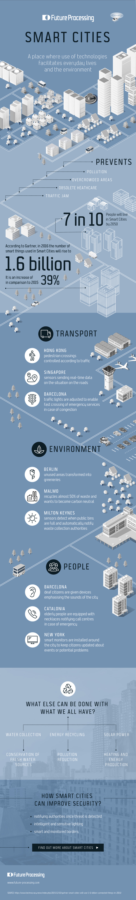

# 智慧城市

一个将技术用于提高日常生活和环境的地方

## 防止

+ 污染
+ 过度拥挤的空间
+ 过时的医疗设施
+ 交通拥挤

## 十分之七

+ 到2050年，将有十分之七的人会生活于智慧城市

## 16 亿

+ 根据加德纳的资料显示，2016 年，用于智能城市的智能设备数量将攀升到16亿个
+ 相比2015年，该数字增长了 39%

## 运输

### 香港

根据交通控制人行道

### 新加坡

传感器发送道路环境的实时数据

### 巴塞罗那

交通信号灯可以灵活调整，以确保路面拥挤时紧急服务的快速通过

## 环境

### 柏林

未利用区域将转变为绿化区域

### 马尔默 （瑞典第三大城市）

循环使用接近 50%的垃圾，尝试实现「碳中立」

### 米尔顿·凯恩斯 （伦敦附近的一个小镇）

传感器实时侦测公共垃圾箱是否满置，然后自动提醒垃圾回收部门处理

## 市民

### 巴塞罗那

失聪的市民将获得可以放大城市声音的设备

### 加泰罗尼亚（西班牙东北部地区）

老人佩戴着项链，可以在紧急状况发生时通知呼叫中心

### 纽约

## 还能做什么？

### 保护水资源

保留洁净的水源

### 回收能源

降低污染

### 太阳能

加热和能源再生

## 智能城市将如何提高安全

+ 只要侦测到危险，就会立即通知相关部门
+ 智能而且灵敏的照明系统
+ 聪明而且受监控的边界
