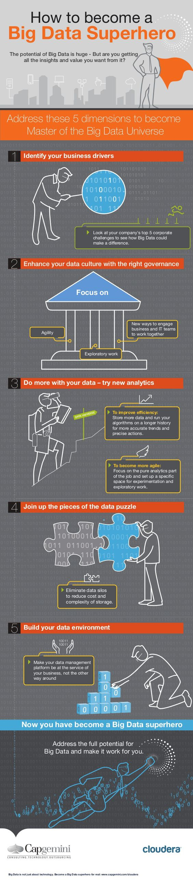

# 如何成为大数据超级英雄

记住以下五个方面，成为大数据世界的超级英雄

## 1. 确定你的商业驱动力

查看你们公司的前五个领跑业务，以确定大数据如何产生作用

## 2.利用合理的管理强化你们的数据文化

专注

敏捷

探索性工作

开展业务和团队协作的新方法

## 3.用你的数据做更多事情 - 尝试新的分析

#### 提高效率

存储更多数据，基于更久的历史数据运行算法，以获得更准确的趋势和精确的行为

#### 更加敏捷

专注于工作中纯粹的数据分析部分，为实验性和探索性工作建立一个专门的工作区

## 4.拼合数据难题

去除数据仓筒以降低成本和存储的复杂性

## 5.搭建数据环境

让你的数据管理平台为你的生意服务，而非分别管理

---

现在你已经变成了一个大数据超级英雄，获得大数据的全部潜能并让它为你工作。