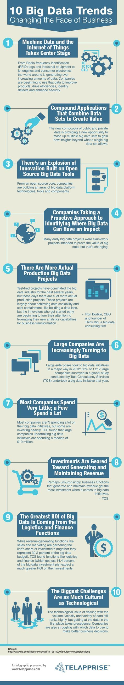

# 10个改变商业形态的大数据趋势

## 1.机器数据和物联网将成为商业的主角

从无线射频识别（RFID)标签和工业装备到喷气机引擎和消费电子设备，我们所处的世界在不断地产生巨量的数据。大公司开始利用这些数据来改进产品，高效驾驶，识别危险以及增强安全。

## 2.结合大数据集用以创造价值的综合应用

新增的大量的公共数据和私人数据为获取新视界提供了新的机会，这种基于多维度大数据集获得的视界将远远超过以往单一维度数据集所提供的视野。

## 3.开源的大数据工具推动着创新的爆发

通过核心的开源工具，许多公司正在创建一系列大数据平台技术，工具和组件

## 4.公司采取主动方法探索大数据可能冲击的商业领域

许多早期的大数据项目都是试图证明大数据价值的「臭鼬工厂」（早期洛克希德公司的机密项目研究部），这种情况正在发生改变。

## 5.有很多更接近产品化的大数据项目

在过去的几年里，实验台项目统治着大数据行业，但是时至今日，已经诞生了大量的接近产品化的项目。这些项目大多在处理数据扩展性和所耗费的存储容量，例如搭建数据池，但是最先开始的发明家们已经将他们的注意力转向了商业领域，利用强大的分析能力推动新的商业变革。

> Ron Bodkin ：Think Big（一家大数据咨询公司） 的CEO和创始人，

## 6.大公司正在不断转向大数据

大型公司在通过各自的大数据提案。在2012年，参加 Tata 咨询服务公司（TCS）开展的全球性调研的1217家公司中，53% 的公司在该年度通过大数据提案

## 7.大多数公司对大数据投资甚少，另外一些投入甚巨

大多数公司在他们的大数据提案中投入不算很多，但是有一些公司投入巨资。 TCS 研究发现，大公司的大数据提案中投入的中位数为 1000万美元

## 8.这些投资旨在创造和维持收益

这并不令人惊讶：大数据提案中旨在创造和维持收益的商业活动获得了最多的投资

## 9.投资回报率（ROI) 最高的大数据项目来自物流和金融活动 

当创造收益的商业活动，例如销售和营销，在投资上占据着极大的比重（一共代表着大数据预算的 30.2）， TCS 研究发现，投入到像物流和金融（一共占据了大数据总投资份额的14.4%）等商业活动的投资有着较高的投资回报率预期。

## 10.最大的挑战存并于技术和文化领域

处理数据容量，速度和种类的技术事宜仍然有着极高的重要性，但是在某个地方最先获得数据有着更高的优先级。各大公司也一直在「使用哪些数据可以帮助制定更好的商业决策」的问题上心力交瘁。