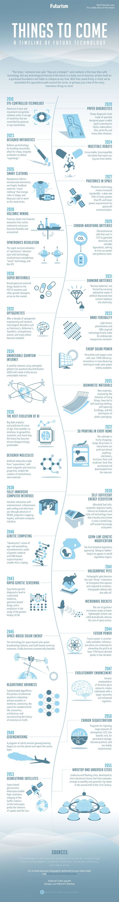

# 将来之物 —— 未来科技的时间轴

`翻译完成`

有人曾说「 时代，在变革 」这句话对于现代的技术领域而言更加贴切。但是任何对于未来技术性的预测的结构都是不可靠的，正如在流沙上构建的宏伟建筑，随时可能倾覆。谨记这个警告，我们将会展现预见性的匆匆一瞥，以窥见那些即将到来的伟大事物。

### 2019年，眼部控制技术

面部和运动识别软件的进步为用姿势和眼球运动控制机器的新时代的到来奠定基础。

### 2020年，纸质诊断工具

价格低廉的特制纸质诊断工具，帮助医生快速扫描埃博拉，肺结核，寨卡，猪流感等疾病。

### 2023年，设计抗生素

借助自下而上的制造大环内酯物的技术，我们得以生产低价的，定制化的抗生素以对抗「超级细菌」

### 2024年，可食用机器人

可降解，生物无排异的的微型机器人可以自动修复我们体内的创口。

### 2026年，智能衣物

纳米多孔纤维，微型电子元件和触觉反馈确保「智能衣物」可以改变颜色和形状，以及根据穿戴者需求而变得凉爽和温暖。

### 2027年，太空光子学

光子技术代表着激增的带宽，数据传输速度比射频传播要快100倍，同时飞船通信需要的能量也更少。

### 2028年，火山挖掘

从活火山挖掘贵金属和矿物，将变得经济可行。

### 2028年，自旋电子学革命

「自旋电子」\(电子自旋技术）的快速商业化，为智能手机，智能技术和物联网带来革命性变化。

### 2029年，碳呼吸电池

电化学电池吸收二氧化碳以产生电能和有价值的副产品，同时解决能源和污染问题。

### 2030年，超级抗病毒

广谱抗病毒药物，基于ISG 15基因的突变体和其他基因疗法，投入市场

### 2031年，钻石电池

「核能电池」通过包围制造人工钻石的所产生的放射性废料，使辐射变为电脑

### 2032年，光电子学

经过数十年的光电子学工程和研究，诸如帕金森综合症，阿尔茨海默氏症，图雷特氏综合征，精神分裂症，自闭症等精神失调症都可治愈。

### 2033年，微型可用性

光驱动的光度计和 DNA激发的生物技术将最终创造广泛廉价的微型科技。

### 2033年，廉价太阳能

钙钛矿和生物组织太阳能电脑达到几乎 100%的能源效率；制造技术的创新促使太阳能变得广泛可用。

### 2034年，不可破解的量子互联网

卫星网络使用光量子纠缠用于量子密钥分发，这将创造一个完全安全，不可破解的互联网

### 2035年，仿生学材料

由生物所激发的新材料，将促进自我清洁衣物，自我修复的建筑，并根清楚塑料袋的使用

### 2036年，人工智能新时代

大数据分析和预测性人工智能开始广泛应用于气候，选举，缘政治学，革命等其他领域。未来似乎变得令人失望地容易预测了。

### 2036年，设计化分子

由「超级原子」制成的人工分子，拥有着全新的磁性和化学特性，确保了革命性新材料的制造。

### 2037年，3D 打印家用物品

终极居家购物时代：每个家庭所拥有的廉价 3D打印机几乎可以按照购买或网上下载的模版文件，打印一切物品 —— 电子元件，家具和药物。

### 2038年，全浸入式电脑交互界面

该界面将在娱乐消遣，查看信息娱乐内容和上网冲浪时提供直觉式的交互体验，让你享受虚拟现实／增强现实中，全息投影映射，体感技术和脑机接口等新技术的全新体验。

### 2039年，自足的能量生态系统

微生物燃料电池，厌氧消化容器，锂离子电池和太阳能电池技术意味着每个家庭事实上都会成为一个闭环自足的能量生态系统。

### 2039年，种系基因修正

第一个的临时的批准「基因设计婴儿」的立法提案开始出现在世界立法机关。

### 2040年，基因计算

「基因算子」开始广泛使用：自装配的，由基因材料和基于 DNA的超级电脑\(比平板电脑还要小\)制成的微型电子元件。

### 2041年，全息宠物

全息宠物，成为下一件「有趣事情」，可交互的人工全息投影宠物可以表达情绪和对情绪作出反应。全息约会网站也将兴起。

### 2043年，快速基因扫描成像

简单的家用基因诊断推动着定制化药物，基于染色体的药物和生命基因历史研究领域的变革。

### 2044年，核聚变能源

核聚变能源已经可以商业化应用，在二十年内将已有输电网络转换为 75%以上能源来自于核聚变的能源网络的基础设施计划开始运行。

### 2045年，天基太阳能

天基的太阳能广播站技术和地基的接收天线技术最终变得经济可行。

### 2045年，算法改进

复杂算法，是高级量子计算机的产物，在医药学，航天航空，寻找地外生命，经济学和重建地球进化史等方面取得突出成就。

### 2047年，革命性改进

针对骨骼基因的骨织素基因的操作，为人类创造更大的新大脑皮层和更强的认知能力。

### 2049年，地球／地质工程

一个方解石气溶胶地质工程项目开始用于行星冷却和臭氧层修复。

### 2050年，碳截留

将大气中的大量二氧化碳气体注入玄武岩以永久存储的程序变得可行，随后广泛应用

### 2053年，地球中微子卫星

天基的地球中微子望远镜确保高解析度的地球内部扫描成像；类似的望远镜用于探测木星和太阳内部结构。

### 2055年，浪顶和海底城市

海底和漂浮城市，为了从海底开采氘混合燃料而发展壮大，在21世纪下半世纪成为富有和强大的城市城邦。

## INDEX

| word | 词 |
| --- | --- |
| Aerosol | 气溶胶，喷雾剂 |
| Anaerobic | 厌氧的 |
| Antivirals | 抗病毒 |
| Autism | 自闭症 |
| Biocompatible | 生物无排异的 |
| Biometirc | 仿生学的 |
| Calcite | 方解石 |
| Deuterium | 氘 |
| Electrochemical | 电化学的 |
| Geopolitics | 地缘政治学 |
| Germ Line | 生殖系，种系 |
| Genetronics | 基因算子 |
| Macrolides | 大环内酯 |
| Nanoporous | 纳米多孔 |
| Neocortex | 新皮质，新大脑皮层 |
| Neurology | 神经学 |
| Optogenetics | 光电子学 |
| Osteocrin | 骨织素 |
| Perovskite | 钙钛矿 |
| Photonics | 光子学 |
| Photomotor | 光度计 |
| Quantum Key Distribution | 量子密钥分发 |
| RF,Radio Frequency | 射频，电磁辐射频率 |
| Rectenna | 硅整流二极管天线 |
| Schizophrenic | 精神分裂症的 |
| Space-based | 基于太空的，天基的 |

