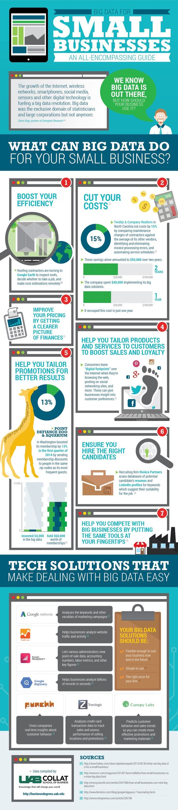

# 小公司的大数据指南

一个无所不包的指南

> 随着互联网的增长，无线网络，智能手机，社交媒体，传感器和其他数码技术正在驱动着大数据变革。大数据是统计学家和大公司的专有领地，并非人人都可以进入。 - Steve King Emergent 研究院合伙人

我们知道大数据的存在，但是你的公司如何利用它呢？

## 大数据可以为你的小公司做什么？

### 1. 提高你的效率

屋顶铺盖承包商正在使用 Google Earth 查看屋顶，依此决定在何处动工和完成远程的成本估算

### 2. 削减你的开支

北卡罗来纳州的 Twiddy & Company Realtors 通过比对其他地产商的承包商维护费用，识别和清除发票处理过程中的错误，自动化规划服务日程。以上过程削减了该公司 15% 的开支。

两年间，该过程节省了总计 50,000 美元的开支

该公司花费了 40,000以应用它们的大数据解决方案。

仅用一年，该公司就收回了大数据方面的投入

### 3.通过获得一个更清晰的金融图景来完善你的定价体系

### 4.帮你为客户选择定制化的产品和服务以提升销量和客户忠诚度

客户在浏览互联网，在社交网络站点发推时会留下「数字脚印」。这些都会帮助我们获得关于客户偏好的商业视野。

### 5.帮助你为客户定制化促销获得更好的促销结果

位于华盛顿的POINT DEFIANCE ZOO & AQUARIUM 通过向和最忠实顾客同区的人们发送会员折扣券使会员数量增加了 13%

### 6.确保你聘用到合适的候选人

招聘公司 Riviera Partners 扫描潜在候选人简历的数据库和领英账户，寻找那些暗示候选人适合当前工作的关键词。

### 7.通过将以下工具放置指尖来帮你和大公司竞争

## 你的大数据解决方案应该是

### 足够灵活，便于你的生意在现在和未来都适用

### 易于使用

### 合适的价格

#### Google AdWords

分析关键字和其他市场营销参数

#### Google Trends

帮助公司分析网站流量和用户行为

#### Roambi Analytics 

让各种需求的管理者查看点规模的数据，计算数目，工作指标和其他关键参数

#### Google BigQuery

帮助公司在几秒内分析数十亿条数据记录

#### punchh

给予公司客户行为的实时分析

### Transzlogic

分析信用卡交易数据以跟踪销售和评估销售选址和促销的表现

### Canopy Labs

预测客户行为和销售趋势，以便于客户更有效地策划促销货和营销材料