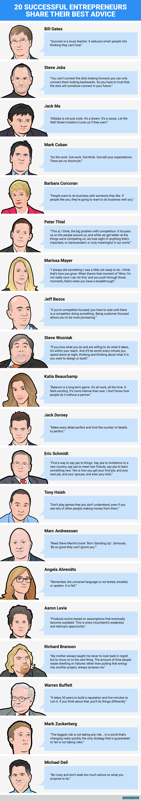

# 20个商业大佬的人生经验

## 图片翻译

#### 比尔·盖茨 (Bill Gates)

> 「成功就像一个蹩脚的老师。他引诱聪明人陷入不能失败的思维困境。」

#### 斯蒂夫·乔布斯 (Steve Jobs)

> 「你无法预测未来，事先准备；只能回首往事，事后总结。所以你要相信，在未来的某个时刻，你所做的一切会突然交汇，联为一体。」

#### 马云 (Jack Ma)

> 「阿里巴巴不是一个工作，而是一个梦想。是一个理由。如果华尔街投资者想要咒骂我们，那就请吧」

#### 马克·库班 (Mark Cuban)

> 「就是干活。发奋工作，竭尽脑汁。始终保持期望。成功没有捷径」

#### 芭芭拉·柯克兰 (Barbara Corcoran)

> 「人们想要和自己欣赏的人做生意。如果他们喜欢你，他们就会和你做生意」

#### 彼得·蒂尔 (Peter Thiel)

> 「我认为，这是竞争的大问题：它让我们过于关注我们身边的人，当我们超越竞争对手时，我们便失去了对世界上那些无比重要的，超然物外的，或是意蕴深刻的事物的焦点」

#### 玛丽莎·梅耶尔 (Marissa Mayer)

> 「我始终在做那些我尚欠准备的事情。我认为这就是成长的方式。当“哇哦，我还不太肯定我能否做到”的时刻出现时，当你竭力渡过这些艰难时刻时，你将取得突破」

#### 杰夫·贝索斯 (Jeff Bezos)

> 「如果你关注的焦点是竞争对手，你会等到竞争对手出现时才有所行动。把关注焦点放在客户上会让你更富开拓性」

#### 斯蒂夫·沃兹尼亚克 (Steve Wozniak)

> 「如果你喜欢你在做的事情，而且打算去做它所相关的事情，这是触手可及的。那些你独自度过夜晚的每一分钟都是值得的，你不断地思考着，考虑着你所想设计或创造的东西」

#### 卡地亚·比彻姆 (Katia Beauchamp)

> 「平衡是一个长期游戏。它始终有效。它让人兴奋不已。它会变得越来越强烈。我无法想象要是没有伙伴的帮助，人们将如何保持平衡」

#### 杰克·多西 (Jack Dorsey)

> 「每个细节都力求完美，然后限制细节的数量以保证完美」

#### 埃里克·施密特 (Eric Schmidt)

> 「寻找一种积极应对事情的方式。对探访新国家的邀请说“好”，对认识新朋友说“好”，对学习新知识说“好”。积极应对帮助你找到第一份工作和下一份工作，以及你的配偶和你的孩子」

#### 谢家华 (Tony Hsieh)

> 「不要做你不了解的事，即使你看到有很多人通过它大赚一笔」

#### 马克·安德森 (Marc Andreessen)

> 「去读斯蒂夫·马丁的书“生来直立”。严肃地说，“做得好到让别人无法忽视”」

#### 安吉拉·阿伦茨 (Angela Ahrendts)

> 「记住，通用语言不是通过发送短信，不是通过发送电子邮件，不是通过讲述。而是通过感觉」

#### 亚伦·李维（Aaron levie）

> 「很多产品基于那些最终会过时的假设更新迭代。这是每个现有公司的弱点，也是每个创业公司的机遇」

#### 理查德·布莱森（Richard Branson）

> 「我妈妈始终教我不要追悔过去而要继续前行。人们将大量的时间浪费在缅怀失败而不是将精力投入到下一个项目，这总让我惊讶。」

#### 沃伦·巴菲特（Warren Buffett）

> 「建立广泛的声誉需要花费20年，而毁掉它只要5分钟。如果你始终考虑这点，做事情就会有所不同」

#### 马克·扎克伯格（Mark Zuckerberg）

> 「最大的风险并不是承担风险...在这个瞬息万变的世界，唯一注定会失败的策略就是不去承担任何风险」

#### 迈克尔·戴尔（Michael Dell）

> 「疯狂一点，不要寻找太多你该做什么的建议」
