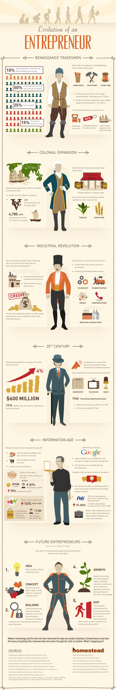

# 创业者的进化史

### 文艺复兴商人

**10%**的人口控制了50%的财富和收入

**50%**的人口分享了15%的财富

**25%**的人分无分文

**15%**逐渐壮大的商人阶级

---

中世纪大约25%的职位是和农业无关的

- 商人
- 工匠
- 其他职业

> 工匠通过学徒制学习专业知识，学徒制最多长达七年

> 工匠行会不断发展，获得了更多的工资，不断在市民生活中施加影响力

市场成为了中心点

- 不断发展商业
- 对新产品日渐增长的需求
- 在向其他国家的交易扩张中领先

### 殖民扩张时代

造船技术的进步推动着国际商贸往来的增加

> 开始了第一家「全球」公司

> 1637年荷兰东印度公司(VOC)成立

4785条商船运输了2500万吨的商品

商人沿着主要的商路建立商贸点，为过往商旅提供补给

美洲农民和种植园主种植例如烟草和甘蔗等经济作物以获取资本

### 工业革命时代

大多数企业家都会发明一些东西并出售，然后开始下一项发明。大多数发明家都在想办法：

> 提高生产力和自动化制造

> 通过规模化制造降低成本

第一个信用扩展系统的应用帮助企业家确保用于大规模，高风险商业投资的资金的安全性。

工业革命时代的企业家：

> 改变了19世纪的商业和工业

> 在很多领域创造了伟大的进步：

- 技术领域
- 运输领域
- 能源领域
- 通信领域
- 工业生产领域

### 20世纪

广告花费增长到国家收入的4%

1910年-大型企业已经在广告营销上花费了6亿美元

大众媒体营销的不断增多改变了企业家销售产品的方式

现在商人们可以向全国销售产品，凭借着这些方式:

- 报纸
- 电视
- 广播
1948年-电视营销萌蘖

> 从1947年开始，广告收入提升了515%

> 933个赞助商购买电视广告

### 信息时代

个人电脑已经改变了日常生活：

> 互联网允许全球访问和及时互联

