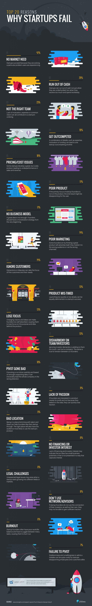

# 创业失败的前20个原因

#### 01.没有市场需求 = `42%`

创业公司获得成功是因为他们解决了用户所经历的某个问题

#### 02.耗尽现金 = `29%`

创业公司不仅会在缺乏投资的情况下用完现金，也会在暴得大名，花费无度的情况下耗尽现金

#### 03.不合适的团队 = `23%`

缺乏动力，不专业，或目光短浅都可能会导致创业失败

#### 04.被超越 = `19%`

一些细节的结合，例如专业技能，激情动力或者投资，会帮助一家创业公司胜过另一家

#### 05.价格／花费问题 = `18%`

一些创业公司开发出一个伟大但是昂贵的产品，导致销售和收益不如预期

#### 06.产品拙劣 = `17%`

如果创始人的主要关注点不是产品，最终成品多半会让用户失望

#### 07.没有商业模式 = `17%`

只有伟大的创意还不够，创始人需要在创业之初就想出盈利策略

#### 08.营销不力 = `14%`

一些创始人错误地认为伟大的产品可以自营销，即使他们把产品推向了错误的用户群或是投放到了错误的市场渠道。

#### 09.忽视客户 = `14%`

分歧或争论会将焦点移到客户和他们的需求之外

#### 10.进度不当 = `13%`

开始太快或太慢对于创业成功都是有害的

#### 11.失去焦点 = `13%`

改变远景和想法可能会让创业者陷入过度自我中心，导致他们不再聚焦于去产品背后的目标和创意

#### 12.团队／投资人不谐 = `13%`

忽视投资人的需求，或让步太多都会伤害团队。合伙人的关系紧张也会如此。

#### 13.转型失败 = `10%`

如果转型不是谨慎地进行，也没有足够数据支持，这将引导公司不可逆转地走向错误。

#### 14.缺乏激情 = `9%`

如果创始人仅仅为了逐利而不是因为对这个想法怀有信心，他们将很快失去方向。

#### 15.位置偏僻 = `9%`

处在一个精英荟萃，创意云集的地方可以帮助创业者审视他们的创意经历。正确的地理位置也促使消费更愿意尝试创业公司的产品。

#### 16.没有金融机构／投资者感兴趣 = `8%`

缺乏金融机构的投资人的关注可能意味着这个想法商业前景有限或者表现形式还不能吸引关注。

#### 17.法律上的挑战 = `8%`

 当创业公司开始向不同的领域或市场扩张时，意料之外的法律问题可能会显现。

#### 18.不利用关系／建议 = `8%`

 如果创业者不利用投资人或者他们自己的关系网络，他们很难获得足够的认同。

#### 19.竭尽全力 = `8%`

创业者经常难以平衡工作／生活，不得不在大量任务间挣扎而精疲力竭。

#### 20.拒绝转型 = `8%`

固执己见，拒绝承认错误对创业公司来说代价高昂，对雇员和顾客而言更是如此。