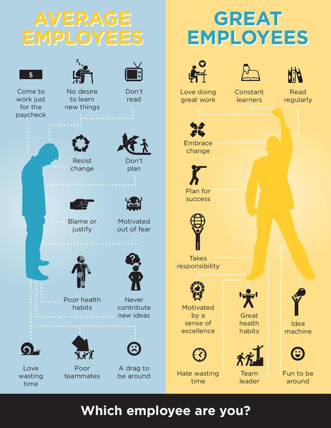

# 你是哪种员工？

## 翻译如下

普通员工|优秀员工
---|---
为钱工作| 热爱工作
没有学习意愿|随时学习
不阅读|时常阅读
抵触变化|时常阅读
不做规划|规划生涯
指责或辩解|担负责任
被恐惧感激励|被成就感激励
糟糕的健康习惯|良好的健康习惯
从不提出新创意|创意工厂
热衷于消磨时间|痛恨浪费时间
坏队友|团队领袖
难相处|好相处

普通员工|优秀员工
---|---
我，为钱而来|知之者不如好之者
太阳底下无新事|手不释卷
读书无用，不如追剧|韦编三绝
这世界变化快|流水不腐，户枢不蠹
说走就走|君子立恒志
这锅谁背下|言必信，行必果
截止日期是第一生产力|发愤忘食，乐以忘忧
生命在于静止|强身健体，壮志坚心
别人肯定做过了|举一反三，触类旁通
不如躺着|逝者如斯，不舍昼夜
我这人性子直|岂曰无衣，与子同袍
别挡着我WIFI信号|君子温润如玉

